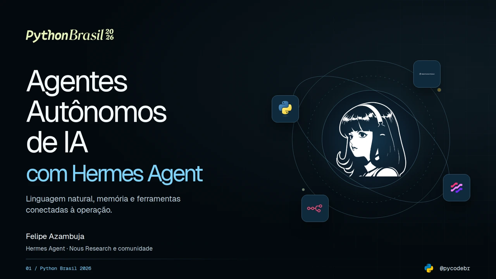

# Agentes Autônomos de IA com Hermes Agent

Slides e materiais da palestra de **Felipe Azambuja**, programador, professor de programação e fundador da **PycodeBR**, na **Python Brasil 2026**.

**[Abrir a apresentação](https://pycodebr.com.br/python-brasil-2026/#1)** · **[Materiais de estudo](#materiais)** · **[Laboratório local](exemplos/README.md)**



A palestra mostra como pedidos em linguagem natural podem se transformar em arquivos, comandos, integrações e entregas verificáveis. O percurso combina memória persistida e auto skills com o Workflow de IA Assistida de cinco passos, a observabilidade de sistemas e uma proposta de manutenção com revisão humana.

**Hermes Agent é um projeto da Nous Research e de sua comunidade.** Felipe utiliza e ensina a ferramenta; não é seu criador.

## Materiais

| Material | O que você encontra |
|---|---|
| [Guia da palestra](materiais/guia-da-palestra.md) | Conceitos, contexto reutilizável e exercícios para continuar o estudo. |
| [Linha do tempo](materiais/linha-do-tempo.md) | Marcos de 2022 a 2026, com distinção entre anúncio, preview e versão. |
| [Workflow de IA Assistida](materiais/workflow-ia-assistida.md) | Os cinco passos, seus artefatos e o ciclo de revisão por sprint. |
| [Observabilidade e manutenção](materiais/observabilidade-e-manutencao.md) | Stack, métricas, logs, dois MCPs e o fluxo report → PR → aprovação → deploy. |
| [Fontes públicas](materiais/fontes.md) | Documentação primária organizada por assunto. |
| [Laboratório em Python](exemplos/README.md) | Simulação local de aprovação, merge, deploy e leitura de confirmação. |

Os guias foram escritos para quem assistiu à palestra e quer aprofundar o assunto. Eles incluem diagramas Mermaid, exemplos e critérios de verificação, sem reproduzir os materiais exclusivos dos treinamentos nem expor sistemas privados.

## Apresentação e downloads

- [Apresentação interativa](https://pycodebr.com.br/python-brasil-2026/#1)
- [PDF da revisão atual](https://pycodebr.com.br/python-brasil-2026/downloads/agentes-autonomos-hermes-python-brasil-2026.pdf?v=2)
- [PowerPoint da revisão atual](https://pycodebr.com.br/python-brasil-2026/downloads/agentes-autonomos-hermes-python-brasil-2026.pptx?v=2)
- [Arquivos de download no repositório](site/downloads/)

A revisão 2 tem **18 slides**, com planejamento de **40 minutos de conteúdo e 5 minutos para perguntas**. A duração depende da condução e do ensaio do palestrante.

O HTML mantém as animações e as demonstrações interativas. O PDF possui texto pesquisável. O PowerPoint preserva o design como **imagens por slide**, com resumos e fontes nas notas; ele não contém texto editável como objetos nem as interações do site.

### Navegação

- Setas ou PageUp/PageDown: slide anterior e próximo.
- Home/End: capa e encerramento.
- **Índice** ou tecla **O**: selecionar um slide.
- **Opções**: tela cheia, animações e downloads.
- **F**: tela cheia quando o navegador permite.
- **B**: escurecer a tela; Escape restaura.
- Links como `#11` ou `#workflow` abrem diretamente uma cena.

Em celulares e tablets na vertical, os componentes se reorganizam em uma leitura vertical, em vez de reduzir todo o slide a uma miniatura. Cada pessoa navega no próprio dispositivo; não há sincronização remota automática com o computador do palestrante.

## O que é ensinado e o que é proposto

O workflow tem origem na **Imersão IA Builders** e nos materiais do **IA Master Elite**, da PycodeBR:

1. Prompt bruto → Prompt refinado.
2. Prompt refinado → `PRD.md`.
3. `PRD.md` → Start Template.
4. Start Template → Sprint.
5. Sprint → Review, Correções e Commit.

O quinto passo se repete a cada sprint. O deploy é considerado desde o planejamento e acontece após a validação; não substitui revisão, correções e commit.

Os encontros Elite #03 e #04 usam o SCSI para explicar deploy, monitoramento e operação por MCPs. A proposta de manutenção do MentorIA acrescenta o percurso completo de reports até a aprovação de uma PR e a verificação após o deploy. **Esse fluxo é uma arquitetura de referência, não uma afirmação de automação ativa em produção.**

Promtail aparece na fonte histórica da aula. O material público identifica **Alloy como atualização recomendada**, conforme a documentação do Grafana, sem alegar uma migração já executada.

## Rodar os slides localmente

O site é estático. Não é necessário ter conta de IA nem configurar credenciais.

```bash
git clone https://github.com/pycodebr/pycodebr_python_brasil_2026.git
cd pycodebr_python_brasil_2026
python3 -m http.server 8000 --bind 127.0.0.1 --directory site
```

Abra `http://127.0.0.1:8000`. Os assets e as fontes estão no repositório; os links de documentação e os materiais no GitHub dependem de conexão à internet.

## Rodar o laboratório

Requer **Python 3.10 ou superior**, apenas com a biblioteca padrão.

```bash
python3 -B exemplos/fluxo_revisao.py
python3 -B exemplos/fluxo_revisao.py --scenario all
python3 -B -m unittest discover -s testes -p 'test_fluxo_revisao.py' -v
```

O laboratório cobre dez percursos fictícios, incluindo testes falhos, silêncio, aprovação obsoleta, deploy falho e escrita com resultado inconclusivo. A saída identifica `simulation: true`. Nenhum comando abre uma PR, envia uma mensagem ou altera um serviço.

## Reconstruir e validar a apresentação

A apresentação pronta está em `site/`. As fontes editoriais e visuais ficam em `src/`, separadas dos scripts de build, testes e exportação.

Para gerar novamente os artefatos, use Python 3.12 ou superior, crie um ambiente virtual e instale as dependências de desenvolvimento. O laboratório, separado desse tooling, funciona com Python 3.10 ou superior.

```bash
python3 -m venv .venv
source .venv/bin/activate
python -m pip install -r requirements-dev.txt
python -m playwright install chromium
python scripts/build.py
python scripts/qa_deck.py
python scripts/export.py
python scripts/build.py
python scripts/check_public.py
ruff check scripts src exemplos testes
```

No Windows, ative o ambiente com `.venv\Scripts\Activate.ps1` no PowerShell. Dependências de sistema dos navegadores devem ser instaladas conforme a documentação do Playwright e a política da sua máquina.

Para testar outros motores, instale-os com `python -m playwright install firefox webkit` e execute `qa_deck.py --engine firefox` ou `--engine webkit`. Os relatórios locais ficam em `qa/`, fora do versionamento público. O comando `node --check site/assets/presentation.js` acrescenta validação sintática quando Node.js estiver disponível.

O QA percorre todas as cenas, verifica limites de layout, imagens, estados interativos, aprovação antes de merge, navegação, movimento e recuperação de posição. As exportações conferem páginas, texto pesquisável, QR Codes e correspondência visual do PDF com os slides.

## Estrutura do repositório

```text
site/          Apresentação pronta, assets e PDF/PPTX
src/           Conteúdo, estados interativos e proveniência de assets
materiais/     Guias, diagramas e fontes públicas
exemplos/      Laboratório local sem rede
testes/        Testes automatizados do laboratório
scripts/       Build, QA, exportação e revisão de conteúdo público
LICENSES/      Licenças de recursos de terceiros
docs/          Imagens de apresentação do repositório
```

## Versões e preservação

- **`v1.0.0`**: arquivos públicos da apresentação original de 34 slides.
- **`v2.0.0`**: revisão de 18 slides, materiais de estudo e laboratório local.
- **`v2.0.1`**: preserva a navegação por setas e PageUp/PageDown após usar os controles interativos.

O histórico público começou com os arquivos que já estavam publicados. Nenhum histórico Git da base privada, roteiro de bastidor, dado de aluno, log de produção ou credencial foi importado.

## Autoria, marcas e continuidade

Conteúdo da palestra: **Felipe Azambuja / PycodeBR**. Implementação assistida por Kratos, usando Hermes Agent. Os logos pertencem aos respectivos titulares e são usados para identificação didática; consulte [THIRD_PARTY.md](THIRD_PARTY.md) para proveniência e licenças.

- [PycodeBR](https://pycodebr.com.br/)
- [Instagram @pycodebr](https://www.instagram.com/pycodebr/)
- [Hermes Agent](https://github.com/NousResearch/hermes-agent)
- [Documentação do Hermes](https://hermes-agent.nousresearch.com/docs/)
- [Python Brasil 2026](https://2026.pythonbrasil.org.br/)
