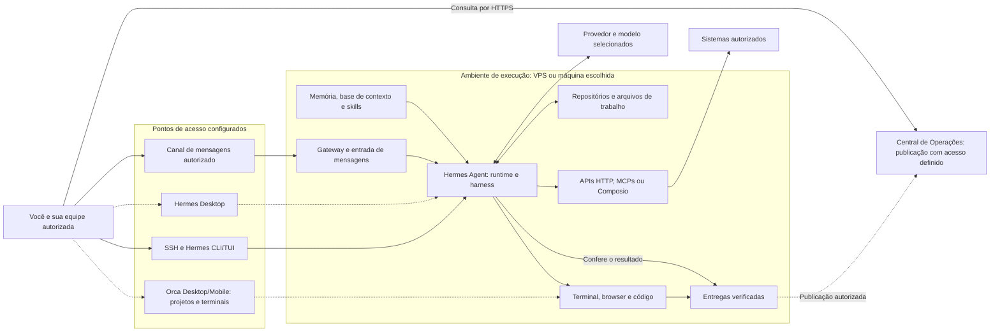
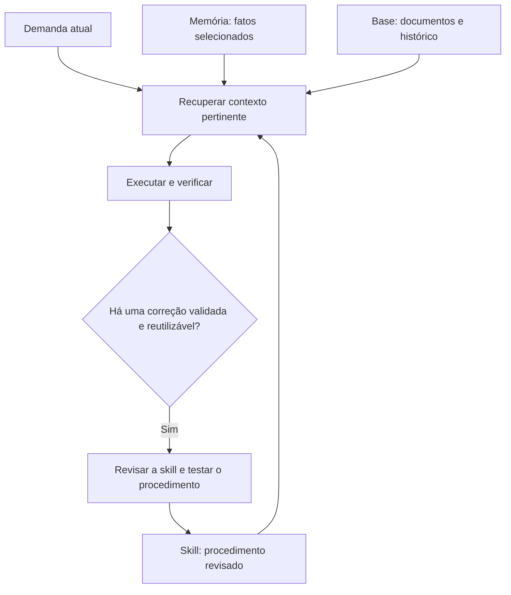

# Arquitetura de uma operação com Hermes Agent

Quando você pede um relatório, uma alteração de código ou um material de estudo, a execução depende de mais do que a conversa com o modelo. Alguém precisa definir onde o agente roda, quais documentos ele consulta, quais sistemas pode acessar e como conferir a entrega. Este guia ajuda você a desenhar essas relações antes de conectar ferramentas.

O desenho adapta a arquitetura conceitual ensinada por Felipe Azambuja na Imersão Agentes Autônomos, da PycodeBR, e apresentada na revisão 3 da palestra **Agentes Autônomos de IA com Hermes Agent**. Ele preserva os papéis dos componentes, sem certificar uma instalação ativa ou expor configurações privadas. Para aplicá-lo em outra operação, você precisa adaptar aplicações, permissões, infraestrutura e critérios de validação.

Comece pelo [guia da palestra](guia-da-palestra.md) se ainda estiver conhecendo o ciclo do agente. A [linha do tempo](linha-do-tempo.md#openclaw-e-hermes-na-onda-de-assistentes-pessoais) explica as renomeações Clawdbot → Moltbot → OpenClaw e o lançamento posterior do Hermes como projeto independente da Nous Research.

## Componentes e caminhos de uma tarefa

O runtime é o processo que executa o agente. O harness organiza o contexto, chama ferramentas e devolve resultados ao modelo. Você pode operar esse runtime pelo terminal ou por uma interface configurada, enquanto uma integração de mensageria encaminha pedidos de um canal autorizado. Esses caminhos precisam apontar para o ambiente e o perfil escolhidos; abrir uma interface não cria automaticamente outra operação isolada.[24][25]

[Abrir a arquitetura em SVG](diagramas/arquitetura-operacao-01.svg).

As setas mostram responsabilidades e caminhos conceituais. As tracejadas destacam opções de acesso ou publicação com configuração própria; nenhuma seta comprova que a conexão esteja instalada, autenticada ou saudável. O desenho usa uma VPS como referência, mas você pode começar numa máquina de desenvolvimento e ampliar o ambiente quando a demanda justificar.

Uma tarefa de relatório, por exemplo, entra pelo canal escolhido, recupera as definições dos indicadores, consulta uma API autorizada e produz um arquivo. Antes de publicar, a verificação confere período, cobertura da coleta e valores com as fontes. Depois da publicação, uma leitura do endereço final confirma que o arquivo esperado está disponível para o público autorizado.

## O que você configura em cada camada

| Camada | Papel | Decisão para seu ambiente |
|---|---|---|
| Interface | Permite enviar pedidos e acompanhar a execução. | Escolher terminal, Desktop ou acesso remoto e conferir a qual runtime/perfil cada interface se conecta. |
| Mensageria | Encaminha mensagens e respostas pelo gateway. | Autorizar canais e pessoas, definir isolamento de sessões e testar recebimento e entrega. |
| Runtime | Executa o ciclo do agente e as ferramentas. | Escolher máquina, usuário, processos supervisionados e limites de recursos. |
| Provedor e modelo | Oferece inferência ao harness. | Avaliar compatibilidade, custos, política de dados e limites; o provedor é uma escolha separada da CLI. |
| Contexto | Oferece fatos, documentos e procedimentos pertinentes. | Separar memória curta, base consultável e skills, com regras de atualização. |
| Projetos | Contém código, especificações e resultados de trabalho. | Definir repositórios, branches, worktrees e arquivos permitidos por tarefa. |
| Integrações | Conecta o agente a capacidades de outros sistemas. | Autenticar cada conexão, descobrir o catálogo e limitar operações e dados. |
| Entregas | Reúne arquivos, painéis ou relatórios conferidos. | Definir aceite, responsáveis pela publicação e público autorizado. |

Hermes Desktop usa o núcleo do Hermes; Orca atende a projetos e terminais e pode oferecer acesso remoto conforme seu setup. SSH transporta uma sessão técnica, enquanto uma VPN, como Tailscale, estabelece uma rede privada para acessos que você configurar. DNS resolve nomes; um proxy HTTPS serve os recursos e pode aplicar autenticação. Esses componentes têm funções diferentes, e usar Cloudflare DNS não implica usar Cloudflare Tunnel.

A **Central de Operações** é o destino conceitual para as entregas da equipe. Ela pode ser um portal ou uma pasta organizada, conforme o projeto. O dashboard administrativo do Hermes gerencia o runtime, e o Grafana consulta telemetria; eles não substituem automaticamente essa central.[24]

## Memória, base de contexto e skills

Se você colocar todos os documentos na memória curta, informações que deveriam ser consultadas sob demanda passam a disputar espaço com o pedido atual. Uma divisão por função permite guardar detalhes e recuperar apenas o que a tarefa exige.[20][21]

| Recurso | O que guardar | Exemplo fictício |
|---|---|---|
| Memória persistida | Fatos e preferências selecionados, pertinentes a outras sessões. | O relatório usa o fuso e o formato acordados com a equipe. |
| Base de contexto | Documentos detalhados, fontes, decisões e histórico consultável. | Definição dos indicadores, regras de negócio e decisões de um projeto. |
| Skills | Procedimentos reutilizáveis, com condições de uso e verificações. | Consultar todas as páginas, conferir cobertura e reler a publicação. |

[Abrir o diagrama de contexto e skills em SVG](diagramas/arquitetura-operacao-02.svg).

No mecanismo nativo do Hermes, a memória persistida é carregada no contexto da sessão; as skills usam carregamento progressivo. A base de contexto é uma organização de documentos que você prepara, por exemplo em Markdown versionado com índices e instruções de consulta. Esses arquivos continuam precisando ser encontrados e lidos. Já o banco de sessões guarda estado do runtime, e o banco da aplicação guarda dados operacionais; ambos ficam separados da documentação da base.[20][21]

Pense numa publicação que serviu um PDF antigo. A investigação identifica a causa e confirma a correção; a skill passa a incluir a comparação entre o arquivo local e o download servido. Na próxima tarefa, o agente recupera esse procedimento e faz a comparação antes de concluir. O aprendizado fica em contexto e arquivos reutilizáveis, sem atualizar os pesos do modelo. Uma correção mal generalizada também pode prejudicar outra tarefa, por isso a revisão do procedimento faz parte do ciclo.

Não guarde credenciais nesses documentos. Use o mecanismo de segredos do ambiente, limite o conteúdo sensível enviado a provedores e estabeleça retenção e acesso para arquivos, sessões e dados de negócio.

## Harnesses de programação e serviços opcionais

Claude Code, Codex CLI e OpenCode são aplicativos que podem conduzir trabalho no repositório. Hermes pode executar esse trabalho diretamente ou delegar recortes a filhos temporários que invoquem uma CLI disponível. A tarefa delegada precisa receber objetivo, contexto, arquivos permitidos e critérios de aceite; o coordenador continua responsável por conferir o diff e integrar resultados.[23]

Selecionar OpenAI ou um caminho de acesso a modelos como OpenCode Go/Zen não equivale a instalar Codex CLI ou OpenCode CLI. Do mesmo modo, criar um subagente temporário não cria automaticamente um perfil persistente, um gateway de mensagens ou uma identidade permanente para atendimento.

Integrações por API, MCP ou Composio permitem consultar serviços de trabalho, conteúdo e negócio. Notion, ClickUp, GitHub e Google Workspace são exemplos de sistemas que podem participar de uma operação; a seleção depende do projeto. Uma lista de aplicações suportadas não comprova conexão ativa. Você precisa conferir instalação, autenticação, escopo de dados e versão de cada ferramenta.[22]

## Adaptação para sua primeira operação

Escolha uma tarefa pequena antes de reproduzir todo o desenho. Um relatório de um sistema de estudo permite exercitar contexto, consulta, verificação e entrega sem conceder acesso a produção.

1. Defina qual resultado você quer conferir, quem pode pedi-lo e quem recebe a entrega.
2. Escolha um runtime e uma interface; confirme o ambiente e o perfil usados pela sessão.
3. Prepare a base mínima com definições e fontes. Guarde na memória apenas fatos selecionados e registre o procedimento recorrente numa skill.
4. Conecte uma fonte de leitura com escopo restrito e dados fictícios. Confira paginação, erros e dados ausentes antes de calcular indicadores.
5. Execute a tarefa, examine o resultado e compare com a fonte. Se publicar, leia o endereço final com a identidade apropriada.
6. Registre as limitações encontradas e só depois considere agendamento, outros canais ou permissões de escrita.

Para outra empresa, revise tenants, isolamento entre contas, disponibilidade, orçamento, volumes, backups, retenção e responsável por decisões sensíveis. Uma VPS single-node concentra risco de indisponibilidade; incluir Docker Swarm no desenho não comprova alta disponibilidade. Uma rede privada também não dispensa autenticação e autorização na aplicação.

Quando a tarefa envolver código, use os [cinco passos do workflow](workflow-ia-assistida.md). Para consultar métricas e logs, acrescente a [arquitetura de monitoria](observabilidade-e-manutencao.md#onde-o-hermes-entra-na-monitoria). A stack ensinada nos encontros Elite #03/#04 pertence ao exemplo SCSI; ela não atesta a stack do MentorIA nem precisa estar na mesma máquina do Hermes.

## Evolução para manutenção com revisão humana

Reports de bugs e sugestões podem iniciar uma investigação por evento ou coleta programada. No blueprint proposto para MentorIA, o Hermes consulta o report pelo MCP do sistema, reúne contexto, define critérios, trabalha em branch ou worktree isolada e prepara testes e uma PR. Felipe recebe a proposta em canal privado e decide sobre a revisão atual.

A sequência de **PR → aprovação → merge → deploy → leitura de confirmação** é uma evolução proposta, sem afirmação de automação ativa em produção. Aprovação e autorização de release precisam estar ligadas à versão e ao ambiente; um report ou log com instruções externas não concede permissão para alterar o sistema. O [fluxo de reports e aprovação](observabilidade-e-manutencao.md#reports-pr-e-aprovação) detalha os gates e as falhas que devem impedir a promoção.

No estudo local, você pode testar essas decisões no [laboratório de revisão](../exemplos/README.md), sem enviar mensagens, abrir PRs ou executar deploys.

## Fontes primárias

Os números seguem a [bibliografia dos materiais](fontes.md). As referências descrevem recursos e mecanismos; a adaptação da topologia e os exemplos deste guia são autorais.

[20] https://hermes-agent.nousresearch.com/docs/user-guide/features/skills | Skills System | Hermes Agent\
[21] https://hermes-agent.nousresearch.com/docs/user-guide/features/memory | Persistent Memory | Hermes Agent\
[22] https://hermes-agent.nousresearch.com/docs/user-guide/features/mcp | MCP | Hermes Agent\
[23] https://hermes-agent.nousresearch.com/docs/user-guide/features/delegation | Delegation | Hermes Agent\
[24] https://hermes-agent.nousresearch.com/docs/user-guide/desktop | Hermes Desktop\
[25] https://hermes-agent.nousresearch.com/docs/user-guide/messaging/ | Messaging | Hermes Agent\
[26] https://hermes-agent.nousresearch.com/docs/user-guide/features/cron | Scheduled Tasks | Hermes Agent\
[27] https://hermes-agent.nousresearch.com/docs/user-guide/messaging/webhooks | Webhooks | Hermes Agent
