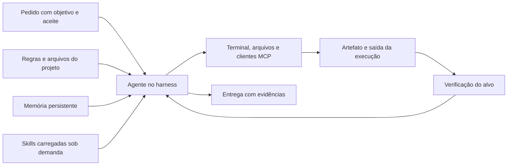

# Guia da palestra: agentes autônomos de IA com Hermes Agent

Quando você pede uma alteração em um sistema, boa parte do trabalho está em recuperar o contexto: regras, decisões anteriores, arquivos envolvidos e formas de conferir o resultado. Um agente com ferramentas pode participar desse trabalho, executar tarefas e guardar procedimentos úteis para a próxima demanda.

Este guia acompanha a palestra de Felipe Azambuja, professor de programação e fundador da PycodeBR, na Python Brasil 2026. O foco é entender como organizar esse contexto, aproveitar o que já foi aprendido e conectar a execução às verificações do projeto.

## Como aprofundar depois da apresentação

- Veja a [apresentação local do repositório](../site/index.html).
- Consulte os exports estáticos em [PDF](../site/downloads/agentes-autonomos-hermes-python-brasil-2026.pdf) e [PPTX](../site/downloads/agentes-autonomos-hermes-python-brasil-2026.pptx).
- Pratique os cinco passos no [workflow de IA assistida](workflow-ia-assistida.md).
- Entenda os marcos [OpenClaw e Hermes na linha do tempo](linha-do-tempo.md#openclaw-e-hermes-na-onda-de-assistentes-pessoais).
- Desenhe os componentes e as permissões com o [guia de arquitetura da operação](arquitetura-operacao.md).
- Estude a arquitetura e o fluxo de reports em [observabilidade e manutenção](observabilidade-e-manutencao.md).
- Use as [fontes públicas agrupadas](fontes.md) para conferir mecanismos e versões.

A revisão 3 da palestra tem 23 slides e reserva 40 minutos para a exposição e 5 minutos para perguntas. Estes materiais desenvolvem os assuntos para estudo posterior, sem exigir contas ou acesso aos sistemas da PycodeBR. Para executar integrações além do laboratório local, você precisará configurar seus próprios acessos autorizados.

## O que acontece entre o pedido e a entrega

O modelo interpreta a demanda e propõe chamadas de ferramentas. O harness é o ambiente que organiza a conversa, oferece essas ferramentas, executa chamadas e devolve os resultados ao modelo. O agente usa esse ciclo para consultar, agir, conferir e continuar a tarefa.

No Hermes Agent, projeto open source da Nous Research e de sua comunidade, memória persistente, skills e integrações MCP ajudam a carregar o contexto necessário para essa execução. Felipe ensina e utiliza a ferramenta; a autoria do Hermes pertence ao projeto e aos seus colaboradores.[20][21][22]

O desenho abaixo é uma proposta ilustrativa de organização, adaptável ao seu projeto. As setas mostram chamadas e leituras, sem representar uma instalação da PycodeBR.



[Abrir o diagrama em SVG](diagramas/guia-da-palestra-01.svg).

Ao revisar uma entrega, procure o arquivo produzido, o comando executado ou o estado consultado. Se a tarefa era corrigir um bug, a evidência deve mostrar o comportamento afetado depois da mudança.

## Contexto que você pode reaproveitar

Uma conversa contém detalhes da demanda atual. As regras do projeto registram convenções que precisam acompanhar outras tarefas. A memória guarda fatos e preferências selecionados entre sessões; no mecanismo nativo do Hermes, esse conteúdo entra no contexto no início da sessão.[21]

A base de contexto conserva o detalhamento: documentos, decisões, fontes e histórico que você organiza em arquivos consultáveis, por exemplo numa base Markdown versionada. Ela precisa de índices e instruções de consulta; guardar um arquivo não garante que ele será recuperado em toda tarefa. Bancos de sessões e dados transacionais também têm funções próprias, separadas dessa documentação.

Já uma skill descreve como realizar uma tarefa recorrente: quando usar, quais entradas reunir, como executar, quais problemas observar e como verificar. O Hermes carrega esse documento quando ele é pertinente, em vez de inserir todo o acervo em cada pedido.[20]

Se você corrigiu um problema de scrape e descobriu uma particularidade do endpoint interno, vale registrar o procedimento validado. Na próxima investigação, a skill pode orientar a consulta e o teste; o estado atual do serviço ainda deve ser consultado.

Por exemplo, uma publicação pode servir um PDF antigo mesmo depois de uma exportação nova. Após corrigir e testar a causa, registre numa skill a comparação entre o arquivo local e o download servido. Na tarefa seguinte, carregue esse procedimento e confira o endereço final antes de concluir. A memória pode guardar sua preferência de formato, enquanto a base conserva as fontes e as decisões da publicação. Esse reaproveitamento melhora o contexto disponível para aquela operação, sem atualizar os pesos do modelo nem garantir melhoria em qualquer tarefa.[20][21]

### Template de contexto reaproveitável

Proposta ilustrativa autoral. Preencha com informações que você pode compartilhar no ambiente escolhido.

```text
Objetivo: qual resultado a próxima tarefa deve produzir?
Projeto: quais arquivos e regras precisam ser consultados?
Decisões: o que já foi escolhido e por qual motivo?
Procedimento: quais passos foram executados e conferidos?
Verificação: qual comportamento demonstra que funcionou?
Atualização: quando revisar este contexto e quem decide mudanças?
```

Prefira regras com motivo e forma de verificação. Guarde segredos no mecanismo apropriado de credenciais, e deixe exemplos públicos com dados fictícios. Quando uma ferramenta ou regra mudar, atualize o contexto e teste novamente o procedimento.

## Três frentes para experimentar

### Conteúdo e pesquisa

Uma demanda de conteúdo pode começar com público, objetivo, fontes autorizadas e padrão editorial. O agente ajuda a reunir referências e produzir um rascunho; a revisão confere atribuições, tom e informações antes de publicar.

Exemplo proposto: preparar um resumo técnico com links primários e registrar uma skill com a estrutura editorial aprovada. O reaproveitamento fica no procedimento, enquanto as fontes da próxima pauta são consultadas novamente.

### Painéis e recursos de uma operação

Uma solicitação de painel precisa informar a origem dos dados, os filtros e a definição de cada indicador. Uma solicitação de recurso exige conhecer o catálogo e o escopo da operação disponível.

Exemplo proposto: consultar métricas de um serviço em uma janela definida e entregar uma investigação com o período, a última amostra e as lacunas encontradas. Para escrever em um sistema, confira a permissão da ferramenta e leia o alvo depois da ação.

### Atendimento e manutenção

Uma resposta útil depende do histórico pertinente, das regras do produto e da situação da pessoa atendida. A conexão com sistemas pode recuperar esse contexto, respeitando o isolamento entre contas e canais.

Exemplo proposto: classificar um report, reproduzir o problema e abrir um PR para revisão. O [blueprint de reports](observabilidade-e-manutencao.md#reports-pr-e-aprovação) detalha a aprovação de Felipe e a verificação após o deploy.

## O agente pode coordenar outras ferramentas

Você pode separar a investigação da implementação. Um agente reúne contexto e critérios, enquanto um harness de programação executa um recorte no repositório. A tarefa delegada precisa receber objetivo, arquivos permitidos, restrições e formato de evidência.

Proposta ilustrativa: o coordenador identifica uma regressão, pede um teste e uma correção em branch isolada, recebe o diff e os resultados executados e confere o aceite. Delegar a implementação preserva a responsabilidade de revisar o resultado e decidir a próxima etapa.

MCP, o Model Context Protocol, fornece mecanismos para descobrir e chamar ferramentas oferecidas por servidores. O Hermes pode conectá-las ao seu ciclo de execução; o conjunto disponível depende da configuração e da autorização.[10][22]

Para iniciar uma tarefa sem pedido no chat, acrescente um evento ou job que chame o agente. No [desenho de manutenção](observabilidade-e-manutencao.md#como-iniciar-uma-investigação), o disparador recebe validação, deduplicação e registro antes de acionar a investigação.

## Um primeiro exercício

Proposta ilustrativa para um repositório de estudo, com dados fictícios e sem acesso a produção.

1. Escolha uma demanda pequena e descreva um comportamento que você consiga testar.
2. Reúna o contexto necessário e siga os [cinco passos](workflow-ia-assistida.md#os-cinco-passos).
3. Execute a verificação e compare o resultado com o requisito original.
4. Registre o procedimento que vale repetir e a condição que exige revisá-lo.
5. Abra outra tarefa semelhante e confira se o contexto reaproveitado orienta a execução.

O exercício permite observar quais instruções ficaram úteis, quais detalhes precisam ser consultados a cada vez e onde a verificação deve melhorar. Separe o fato curto que cabe na memória, o documento que pertence à base e o procedimento que vale registrar numa skill. As decisões de infraestrutura têm continuidade na [arquitetura da operação](arquitetura-operacao.md) e no [guia de observabilidade](observabilidade-e-manutencao.md).

## Origem dos ensinamentos

A sequência de desenvolvimento é uma adaptação autoral do workflow ensinado na Imersão IA Builders, da PycodeBR. Os encontros Elite #03 e #04 usam o projeto SCSI para ensinar deploy, monitoramento e operação por dois MCPs. O encadeamento de reports do MentorIA apresentado nestes materiais é uma proposta ilustrativa, sem afirmação de automação ativa.

A adaptação pública preserva o método e os mecanismos, sem reproduzir prompts ou materiais exclusivos. A documentação primária sustenta as capacidades técnicas; o estado de cada implantação precisa ser verificado no ambiente correspondente.

## Fontes

[10] https://modelcontextprotocol.io/specification/2025-06-18/server/tools | Tools | Model Context Protocol\
[20] https://hermes-agent.nousresearch.com/docs/user-guide/features/skills | Skills System | Hermes Agent\
[21] https://hermes-agent.nousresearch.com/docs/user-guide/features/memory | Persistent Memory | Hermes Agent\
[22] https://hermes-agent.nousresearch.com/docs/user-guide/features/mcp | MCP | Hermes Agent
