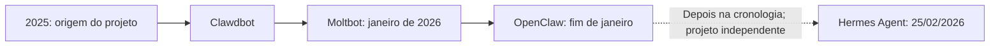

# Linha do tempo: interfaces, ferramentas e continuidade

A sequência de 2022 a 2026 organiza os marcos usados na palestra. Ela não representa o nascimento da inteligência artificial nem uma substituição completa de uma abordagem pela seguinte. Bibliotecas, workflows visuais, CLIs e agentes com memória continuam coexistindo.

## Marcos e o que eles significam

| Período | Marco | Mudança relevante para a palestra |
|---|---|---|
| 24/10/2022 | Primeiro pacote Python do LangChain | Composição de aplicações que conectam modelos a outros componentes. |
| 30/11/2022 | Apresentação pública do ChatGPT | Popularização de uma interface conversacional para modelos de linguagem. |
| 2023 | Experimentos com AutoGPT e expansão de construtores de fluxos | Discussão sobre objetivos, ferramentas, ciclos e sequências de execução. |
| Outubro de 2023 | Integração LangChain no n8n | Componentes de IA em uma ferramenta de automação que já existia desde 2019. |
| Janeiro de 2024 | Anúncio do LangGraph | Organização de execução com estado e ciclos. |
| 24/06/2024 | Langflow 1.0 | Marco de versão de uma ferramenta visual que já tinha releases anteriores. |
| 25/11/2024 | Apresentação do Model Context Protocol | Protocolo para conectar aplicações de IA a ferramentas e dados. |
| 24/02/2025 | Claude Code em research preview | Trabalho assistido no ambiente do projeto, com arquivos e terminal. |
| 16/04/2025 | Codex CLI apresentado publicamente | Agente de programação executado pelo terminal. |
| 22/05/2025 | Claude Code em disponibilidade geral | Marco distinto do preview de fevereiro. |
| 2025 | Agent Skills | Instruções, scripts e recursos organizados para carregamento sob demanda. |
| Novembro de 2025 | Origem do projeto que se tornou OpenClaw | Assistente pessoal executado na infraestrutura escolhida pelo usuário; a origem antecede a popularização de 2026. |
| Janeiro de 2026 | Popularização e renomeações Clawdbot → Moltbot → OpenClaw | Nomes sucessivos do mesmo projeto, com execução por ferramentas e acesso por aplicativos de mensagem. |
| 25/02/2026 | Hermes Agent no catálogo da Nous Research | Execução por ferramentas combinada com memória, skills, delegação e canais. |

## OpenClaw e Hermes na onda de assistentes pessoais

Se você encontrou referências a Clawdbot, Moltbot e OpenClaw, está lendo sobre nomes sucessivos do mesmo projeto. O criador situa sua origem em novembro de 2025. A popularização e as renomeações ocorreram em janeiro de 2026, quando o acesso por mensagens a um assistente hospedado pelo próprio usuário ganhou atenção. OpenClaw aparece na palestra como **um dos pioneiros desta onda de assistentes pessoais open source**; esse recorte não reivindica a invenção de todos os agentes autônomos.[13][14]

[Abrir a sequência histórica em SVG](diagramas/linha-do-tempo-01.svg).

A seta tracejada indica apenas ordem temporal entre projetos independentes, sem representar uma relação de fork ou sucessão oficial. Hermes é um projeto da Nous Research, que registra seu lançamento em 25 de fevereiro de 2026; seu núcleo em Python reúne execução por ferramentas, memória persistida e procedimentos em skills.[12]

As fontes do OpenClaw têm uma diferença de data que importa se você montar uma cronologia diária: o blog apresenta o anúncio com data editorial de 29 de janeiro, enquanto a documentação situa a migração final em 30 de janeiro. Aqui usamos “fim de janeiro” para preservar o marco sem confundir anúncio e migração. A primeira mudança, para Moltbot, aparece na documentação em 27 de janeiro, após um pedido da Anthropic relacionado à marca; essas fontes não comprovam um processo judicial.[13][14]

## Por que separar as camadas

O **modelo** produz respostas e chamadas de ferramentas. O **harness** organiza o contexto, o ciclo e a execução dessas ferramentas; Claude Code, Codex CLI e OpenCode são exemplos de harnesses de programação. Uma **interface** permite interagir com o runtime escolhido. Uma **skill** descreve procedimentos e recursos que podem ser reutilizados. O **MCP** padroniza a integração com servidores que oferecem capacidades.

Isso ajuda a localizar responsabilidades. Um erro pode estar na especificação, na escolha de uma ferramenta, na autorização, no código executado ou na verificação. Trocar o modelo não corrige automaticamente uma integração sem escopo ou uma regra de negócio incompleta.

A memória acrescenta continuidade: fatos selecionados e procedimentos documentados podem voltar ao contexto de outra tarefa. No Hermes, a criação e a revisão de skills permitem reaproveitar o que foi aprendido no trabalho. Esse mecanismo é externo aos pesos do modelo.

## Três movimentos que se combinam

- **CLIs de programação:** acesso ao ambiente do projeto, arquivos, comandos e testes.
- **Skills, plugins e MCPs:** conhecimento operacional reutilizável e conexões com ferramentas.
- **Agentes autônomos com memória:** continuidade entre demandas, sessões e canais, dentro de regras de execução.

Um agente pode usar uma CLI e carregar uma skill para consultar um sistema pelo MCP. Um workflow determinístico pode chamar um modelo em uma etapa. A escolha depende da tarefa e dos critérios de verificação, e não de encaixar todas as necessidades em um único produto.

## Fontes primárias

1. [LangChain: retrospectiva do primeiro pacote Python](https://www.langchain.com/blog/announcing-our-10m-seed-round-led-by-benchmark).
2. [OpenAI: Introducing ChatGPT](https://openai.com/index/chatgpt/).
3. [AutoGPT: release v0.1.0](https://github.com/Significant-Gravitas/AutoGPT/releases/tag/v0.1.0). Criação de repositório, demonstração e release são eventos distintos; esta tabela não atribui uma primeira release a março.
4. [n8n: integração LangChain nos destaques de outubro de 2023](https://blog.n8n.io/n8ns-october-highlights-new-features-refined-cloud-plans-and-workflow-editor-improvements).
5. [n8n: histórico desde 2019](https://blog.n8n.io/celebrating-n8n-second-anniversary/).
6. [LangGraph: publicação técnica](https://www.langchain.com/blog/langgraph) e [anúncio no LangChain 0.1.0](https://www.langchain.com/blog/langchain-v0-1-0).
7. [Langflow 1.0](https://www.langflow.org/blog/langflow-1-0-is-out-with-a-cloud-service).
8. [Anthropic: Model Context Protocol](https://www.anthropic.com/news/model-context-protocol).
9. [Claude Code: preview](https://www.anthropic.com/news/claude-3-7-sonnet) e [disponibilidade geral](https://www.anthropic.com/news/claude-4).
10. [OpenAI: anúncio do Codex CLI](https://openai.com/index/introducing-o3-and-o4-mini/).
11. [Agent Skills: especificação](https://agentskills.io/specification) e [explicação técnica](https://www.anthropic.com/engineering/equipping-agents-for-the-real-world-with-agent-skills).
12. [Nous Research: catálogo de releases](https://nousresearch.com/releases) e [documentação do Hermes Agent](https://hermes-agent.nousresearch.com/docs/).
13. [OpenClaw: Introducing OpenClaw](https://openclaw.ai/blog/introducing-openclaw), com relato da origem e das renomeações.
14. [OpenClaw: história do projeto](https://docs.openclaw.ai/start/lore), com as datas de Moltbot e da migração final.

Para seguir, consulte o [guia da palestra](guia-da-palestra.md), a [arquitetura da operação](arquitetura-operacao.md), o [workflow de cinco passos](workflow-ia-assistida.md) e a [bibliografia de operação e observabilidade](fontes.md).
