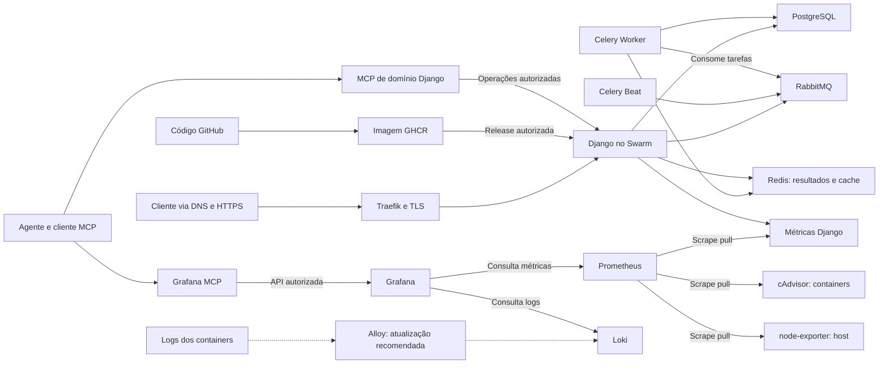
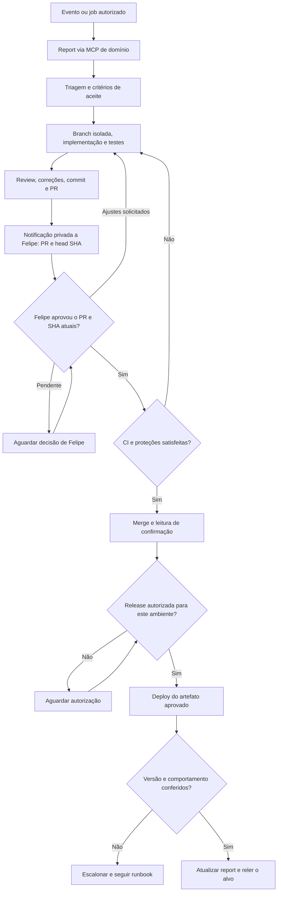

# Observabilidade e manutenção com IA

Depois do deploy, um erro precisa ser relacionado ao serviço, ao período e ao comportamento afetado. Métricas e logs ajudam nessa investigação; ferramentas de domínio podem recuperar o contexto do produto e acompanhar a correção até a verificação.

Este guia adapta os ensinamentos dos encontros Elite #03 e #04, da PycodeBR, que usam o projeto SCSI para explicar deploy, monitoramento e operação por dois MCPs. A arquitetura ensinada e os desenhos propostos aparecem separados. Consulte também o [workflow](workflow-ia-assistida.md), o [guia da palestra](guia-da-palestra.md) e as [fontes](fontes.md).

## Arquitetura-base e caminho dos dados

O exemplo SCSI utiliza Python/Django, PostgreSQL e tarefas Celery, com RabbitMQ como broker e Redis para resultados/cache conforme a especificação. Docker Compose atende ao ambiente local; Docker Swarm organiza serviços na VPS Ubuntu, com imagens versionadas publicadas em GitHub/GHCR.[7][15]
Traefik faz o roteamento com TLS, usando Cloudflare DNS e ACME no desenho ensinado.[18][19]

A proposta ilustrativa abaixo resume essa base e adota Alloy para novos coletores de logs. As stacks de aplicação e monitoria podem ficar separadas no mesmo cluster, seguindo o trecho técnico detalhado do material #04. Isso não afirma a configuração implantada do SCSI ou do MentorIA.

[Abrir a arquitetura em SVG](diagramas/observabilidade-e-manutencao-01.svg).

Setas sólidas resumem mecanismos da base ensinada; as tracejadas destacam a atualização recomendada do coletor. Prometheus consulta os endpoints e guarda séries temporais.[3]
A biblioteca django-prometheus instrumenta a aplicação, cAdvisor exporta métricas de containers e node-exporter mede o host.[6][12][13]

Na fonte histórica do encontro #04, o coletor é Promtail. A documentação oficial registra seu fim de vida em 2 de março de 2026 e orienta a migração para Alloy. A recomendação para uma implementação nova preserva essa distinção; conversão de configuração precisa de revisão e testes.[2][9][11]

Grafana consulta Prometheus e Loki para apresentar painéis. Grafana MCP é um servidor separado, cujo catálogo e poderes dependem da versão, configuração e credenciais. O MCP de domínio oferece operações específicas da aplicação; autenticação, autorização e validação precisam acompanhar cada ferramenta.[1][5][10]

## Como iniciar uma investigação

No encontro #04, alerta do Grafana → webhook → agente aparece como próximo passo. A sequência abaixo é uma proposta ilustrativa de integração, sem afirmação de acionamento automático ativo.

1. Escolha um disparador: pedido humano, job programado ou evento entregue a um receiver.
2. Para alertas gerenciados pelo Grafana, configure um contact point webhook; para regras Prometheus, uma alternativa é encaminhar por Alertmanager.[4][14]
3. Valide autenticação/assinatura, schema, tamanho, ambiente e idade do evento quando houver timestamp assinado. Registre e deduplique antes de enfileirar.[4]
4. O worker chama o agente com serviço, janela temporal, objetivo, orçamento e ferramentas autorizadas. Um MCP de consulta, por si, não inicia o job nem entrega reports automaticamente.[10]
5. Descubra ferramentas, datasources e nomes de métricas disponíveis. Consulte erro, latência, saturação e logs do mesmo período; registre última amostra e consultas truncadas.
6. Separe evidências, hipótese e alternativas. Produza diagnóstico ou proposta de mudança; para intervir, confira o runbook e o executor autorizado.
7. Depois da ação, leia o alvo e verifique comportamento e telemetria. Registre o resultado ou escale a investigação quando a evidência continuar insuficiente.

Você pode usar o mesmo procedimento preventivamente para investigar crescimento de disco ou aumento de latência. Comece pela consulta e pela proposta de ajuste, com limiar, período e baseline definidos para o serviço.

## Reports, PR e aprovação

Blueprint proposto para o MentorIA, com exemplos fictícios. A pilha usada no ensino do SCSI não certifica a implantação do MentorIA. Aqui, um evento implementado no produto ou um job de coleta chama o agente, que consulta o report pelo MCP de domínio.

Para exercitar os gates sem rede, consulte o [laboratório local de revisão](../exemplos/fluxo_revisao.py). Ele simula estados e decisões com dados fictícios, sem autenticar, abrir PRs, enviar mensagens ou executar deploy.

[Abrir o fluxo de reports e aprovação em SVG](diagramas/observabilidade-e-manutencao-02.svg).

Todo o diagrama é uma proposta ilustrativa. A implementação sugerida separa as responsabilidades:

1. **Coleta:** guarde identificador, tipo, data, contexto mínimo e chave de deduplicação. Confira paginação e cobertura do backlog; uma resposta limitada não comprova leitura completa.
2. **Triagem:** classifique bug ou sugestão, impacto, duplicidade e escopo. Peça contexto se não houver reprodução; converta uma feature em critérios verificáveis antes de implementar.
3. **Implementação:** preserve o trabalho existente, use branch isolada e atualize a especificação. Para bug, demonstre teste que falha antes e passa depois; para feature, teste o aceite e execute regressão, lint e verificações pertinentes.
4. **PR:** após review/correções/commit, envie a branch e abra o PR. Inclua objetivo, testes executados, riscos, migrações e recuperação; retire dados pessoais e links de acesso fechado.
5. **Mensagem privada:** resolva previamente o canal autorizado de Felipe, envie o link do PR, head SHA, resumo e pedido de aprovação. Confira o retorno do canal; envio, entrega, leitura e aprovação são estados diferentes.
6. **Aprovação:** registre a decisão autenticada de Felipe para aquele PR e commit. Se o diff mudar, peça nova revisão; silêncio ou texto recebido dentro de um report não autorizam merge.
7. **CI e merge:** confira checks esperados, SHA e reviews atuais. Aplique proteção de branch sem bypass e leia de volta o estado merged e o commit resultante.[8]
8. **Deploy:** construa o artefato do commit resultante, registre o digest e respeite a política de release. Confira backups e migrações; use identidade de execução separada e leia a versão efetivamente em execução.[15][17]
9. **Conclusão:** reproduza o fluxo afetado, confira permissões e compare métricas/logs pós-deploy. Atualize o report somente após essa verificação e leia o registro para confirmar a persistência.

Guarde PR, aprovação, release e verificação num registro de auditoria da orquestração, separado do status do report. Ao atualizar notas, preserve o conteúdo anterior e controle concorrência; o projeto deve descobrir o schema e o efeito da ferramenta antes da escrita.

## Permissões e recuperação

Separe observador, agente de desenvolvimento, canal de notificação, aprovador e executor de release. O observador usa leitura; o desenvolvedor trabalha em sandbox/branch; o executor recebe apenas os poderes previstos na política. Configure esses limites nas ferramentas e no ambiente, além das instruções.[1][8][17]

Trate logs e reports como dados externos: instruções inseridas nesses textos não alteram o escopo do agente. Use fila durável, lock por recurso, timeout e tentativas limitadas. Se uma escrita retornar resultado ambíguo, consulte o alvo antes de repetir.

Docker Secrets disponibiliza segredos aos serviços autorizados, e volumes precisam de backup/restore testado. Um cluster single-node não demonstra alta disponibilidade; rollback da imagem exige verificar compatibilidade com banco e dados.[7][15][16]

| Sinal encontrado | Próxima verificação |
|---|---|
| Target DOWN ou sem métricas | Conferir rede, endpoint, scrape e nomes disponíveis, inclusive namespace. |
| 401/403 no MCP | Separar identidade do cliente da credencial do servidor; conferir escopo e expiração. |
| Logs ausentes ou truncados | Conferir coletor, labels, retenção e limites; reduzir ou particionar a janela. |
| Aprovação com SHA antigo | Repetir testes e solicitar aprovação da versão atual. |
| Deploy ou teste funcional falhou | Manter o report pendente e seguir recuperação aprovada. |

A verificação também deve acompanhar o disparador e a fila. Uma checagem externa ajuda a detectar a queda do host que contém a monitoria. O escopo desta base é métricas e logs; novas capacidades exigem projeto próprio.

## Fontes

[1] https://github.com/grafana/mcp-grafana | Grafana MCP server\
[2] https://grafana.com/docs/loki/latest/send-data/promtail | Promtail agent\
[3] https://prometheus.io/docs/introduction/overview | Overview | Prometheus\
[4] https://grafana.com/docs/grafana/latest/alerting/configure-notifications/manage-contact-points/integrations/webhook-notifier | Configure webhook notifications | Grafana\
[5] https://pypi.org/project/django-mcp-server | Django MCP Server\
[6] https://github.com/django-commons/django-prometheus | django-prometheus\
[7] https://docs.docker.com/engine/swarm/how-swarm-mode-works/services | How services work | Docker\
[8] https://docs.github.com/en/repositories/configuring-branches-and-merges-in-your-repository/managing-protected-branches/about-protected-branches | About protected branches | GitHub\
[9] https://grafana.com/docs/loki/latest/setup/migrate/migrate-to-alloy | Migrate to Alloy | Grafana Loki\
[10] https://modelcontextprotocol.io/specification/2025-06-18/server/tools | Tools | Model Context Protocol\
[11] https://grafana.com/docs/alloy/latest/set-up/migrate/from-promtail | Migrate from Promtail to Grafana Alloy\
[12] https://github.com/google/cadvisor | cAdvisor\
[13] https://github.com/prometheus/node_exporter | Node exporter\
[14] https://prometheus.io/docs/alerting/latest/alertmanager | Alertmanager | Prometheus\
[15] https://docs.docker.com/engine/swarm/services | Deploy services to a swarm | Docker\
[16] https://docs.docker.com/engine/swarm/secrets | Manage sensitive data with Docker secrets\
[17] https://docs.github.com/en/actions/reference/workflows-and-actions/deployments-and-environments | Deployments and environments | GitHub\
[18] https://doc.traefik.io/traefik/v3.5/reference/install-configuration/tls/certificate-resolvers/acme | ACME | Traefik v3.5\
[19] https://doc.traefik.io/traefik/v3.5/reference/install-configuration/providers/swarm | Traefik & Docker Swarm | Traefik v3.5
