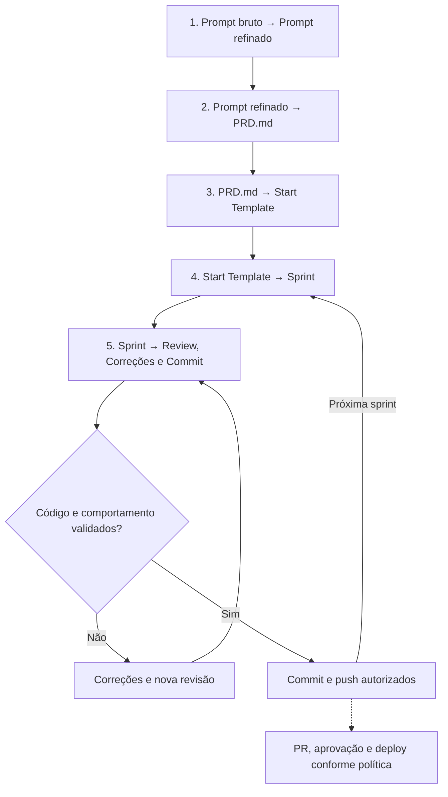

# Workflow de IA assistida: contexto, implementação e revisão

Uma IA consegue escrever código antes de a equipe terminar de entender a demanda. Para acompanhar esse trabalho, você precisa de uma especificação que permita comparar o que foi pedido com o que foi implementado, além de testes e revisão a cada recorte.

Este material adapta, em texto autoral, o workflow ensinado por Felipe Azambuja na Imersão IA Builders, da PycodeBR. Os cinco passos mantêm a sequência do método; os critérios de passagem descritos aqui são recomendações de engenharia para você aplicá-lo no seu projeto.

Leia também o [guia da palestra](guia-da-palestra.md), a [observabilidade e manutenção](observabilidade-e-manutencao.md) e as [fontes públicas](fontes.md).

## Os cinco passos

### 1. Prompt bruto → Prompt refinado

**Entrada:** objetivo do sistema, usuários, fluxos, regras, requisitos funcionais e não funcionais, restrições e decisões técnicas conhecidas. Inclua a arquitetura prevista para o deploy e separe escolhas confirmadas de questões em aberto.

**Execução:** use a IA para organizar esse contexto em uma descrição estruturada. Peça que ela aponte lacunas e ambiguidades, sem completar decisões de negócio por conta própria.

**Saída e conferência:** um prompt refinado que preserve a demanda. Leia com os envolvidos, compare com a entrada e devolva para refinamento se houver requisito omitido ou escolha sem aprovação.

### 2. Prompt refinado → PRD.md

**Entrada:** prompt refinado conferido. PRD significa documento de requisitos do produto; o arquivo `PRD.md` organiza o comportamento esperado e o trabalho de implementação.

**Execução:** descreva usuários, regras, escopo, arquitetura, requisitos e critérios de aceite. Divida o trabalho em sprints que produzam resultados verificáveis e registre dependências entre elas.

**Saída e conferência:** `PRD.md` revisado antes de implementar. Para cada requisito, indique como verificar o resultado; corrija ambiguidades no PRD e retorne ao prompt refinado quando a demanda precisar mudar.

### 3. PRD.md → Start Template

**Entrada:** PRD revisado e referência visual, quando houver interface. Start Template é a estrutura inicial que permite executar o projeto e começar a implementação no contexto adequado.

**Execução:** prepare a pasta do projeto, o ambiente virtual, as dependências, a estrutura da aplicação e o versionamento. Coloque o PRD na raiz e documente como iniciar o projeto e executar os testes.

**Saída e conferência:** base executável, com configuração de exemplo sem segredos e referências do projeto disponíveis. O exemplo da Imersão usa Django; a estrutura deve acompanhar a tecnologia escolhida em cada projeto.

### 4. Start Template → Sprint

**Entrada:** estrutura inicial ou estado aprovado da sprint anterior, PRD, código e padrões existentes.

**Execução:** implemente uma sprint por vez. Informe o recorte, os arquivos permitidos, os critérios e as verificações esperadas; acompanhe o diff e atualize o andamento sem confundir tarefa marcada com comportamento validado.

**Saída e conferência:** alterações disponíveis para revisão, com resultados de execução e pendências identificadas. Passe pelo quinto passo antes de iniciar a sprint seguinte.

### 5. Sprint → Review, Correções e Commit

**Entrada:** sprint implementada, requisitos e diff. Confira tanto o código quanto o comportamento, incluindo autorização e isolamento de dados quando o projeto exigir.

**Execução:** revise, corrija e execute novamente os testes pertinentes. Registre o que passou, o que falhou e o que não foi testado; faça commit e push somente do trabalho validado, no destino autorizado.

**Saída e retorno:** mudança revisada e versionada. Volte ao passo 4 para a próxima sprint; ao terminar o conjunto, faça revisão geral e organize os ajustes restantes.

O deploy participa do planejamento desde os passos 1 e 2 e ocorre após a validação. Ele não substitui **Sprint → Review, Correções e Commit**. Em equipe, o push pode ir para uma branch e a revisão por PR acrescenta um gate antes do merge.[8]

## O ciclo de implementação

Diagrama autoral do método. O gate de validação explicita a recomendação de revisão; a seta tracejada indica a etapa de release, detalhada no [blueprint de manutenção](observabilidade-e-manutencao.md#reports-pr-e-aprovação).



## Exemplo para praticar com dados fictícios

[Abrir o diagrama do workflow em SVG](diagramas/workflow-ia-assistida-01.svg).

Proposta ilustrativa: um sistema de tarefas no qual cada conta consulta apenas seus próprios registros. A primeira sprint entrega criação e listagem autenticadas; lembretes, relatórios e integrações ficam fora desse recorte.

No prompt bruto, descreva quem usa o sistema e a regra de isolamento. No refinamento, confira se a IA preservou essa regra. No PRD, registre um teste com duas contas fictícias para demonstrar que a listagem de uma não devolve registros da outra.

Prepare o template e execute essa sprint. Na revisão, confira o filtro aplicado pela aplicação e execute o teste de isolamento, além dos testes de criação e autenticação. Se a regra falhar, corrija e repita as verificações antes do commit.

### Template de demanda

Proposta ilustrativa autoral. Use os mesmos campos ao solicitar uma feature ou investigar um bug.

```text
Objetivo: criar e listar tarefas da conta autenticada.
Contexto: projeto de estudo, duas contas fictícias, sem dados de produção.
Escopo: criação e listagem; sem lembretes ou compartilhamento.
Regras: título obrigatório; cada conta acessa apenas suas tarefas.
Aceite: criação válida persiste; outra conta não recebe o registro.
Verificação: testes de criação, autenticação e isolamento entre contas.
```

### Template de revisão da sprint

Proposta ilustrativa autoral. Preencha resultados somente depois de executar as verificações.

```text
Sprint e requisitos: quais itens do PRD foram implementados?
Mudanças: quais arquivos e comportamentos foram alterados?
Execução: quais comandos rodaram e quais resultados retornaram?
Pendências: o que falhou, ficou fora ou depende de outra decisão?
Risco: quais efeitos existem sobre dados, acessos e recuperação?
Decisão: corrigir, revisar novamente ou versionar o trabalho aprovado?
```

## Quem organiza a execução

O agente precisa de acesso aos arquivos e ferramentas pertinentes para consultar o projeto, alterar o código e executar testes. O harness devolve o resultado das chamadas; a tarefa deve pedir evidências de execução, além de uma descrição da mudança.

Quando outro harness participa, repasse o PRD, o recorte da sprint, as regras locais e o formato da entrega. Compare o diff e os testes recebidos com o aceite antes de integrar a alteração.

Registre procedimentos repetidos como skills: preparação do ambiente, testes obrigatórios, revisão e recuperação de falhas conhecidas. No Hermes, skills podem ser carregadas sob demanda; a memória persistente guarda fatos selecionados e preferências entre sessões.[20][21]

O [template de contexto](guia-da-palestra.md#template-de-contexto-reaproveitável) ajuda a organizar o que será reutilizado. Atualize a especificação quando a regra do produto mudar e teste os procedimentos após mudanças de dependências.

## Conferência antes de avançar

- O prompt refinado preserva a demanda e identifica decisões pendentes.
- O PRD permite conferir cada sprint e inclui operação, dados e deploy.
- O template inicia e possui um caminho documentado para executar testes.
- A sprint respeita o escopo e preserva alterações anteriores da equipe.
- O review compara comportamento e diff com os critérios de aceite.
- O commit contém apenas a mudança validada e vai para o destino autorizado.

Para projetos em operação, acrescente a triagem, o PR, a aprovação e a verificação pós-deploy descritos em [observabilidade e manutenção](observabilidade-e-manutencao.md). A definição de requisitos continua útil quando a próxima demanda vier de um report ou de uma investigação de telemetria.

## Fontes

[8] https://docs.github.com/en/repositories/configuring-branches-and-merges-in-your-repository/managing-protected-branches/about-protected-branches | About protected branches | GitHub\
[20] https://hermes-agent.nousresearch.com/docs/user-guide/features/skills | Skills System | Hermes Agent\
[21] https://hermes-agent.nousresearch.com/docs/user-guide/features/memory | Persistent Memory | Hermes Agent
